# Mikroservis Mimarisi ve API Gateway Sistemi

**Proje Ekibi:**  
- Emirhan Oktay — 231307074  
- Efekan Demir — 231307054  

**Tarih:** 04.04.2026

---

## 1. Giriş
Bu projenin temel amacı, modern yazılım mühendisliği yaklaşımlarını kullanarak ölçeklenebilir, bakımı kolay ve modüler bir mimari tasarlamaktır. Geleneksel monolitik yapılar yerine, sistem farklı iş etki alanlarına (kimlik doğrulama, ürün yönetimi, raporlama) göre izole mikroservislere ayrılmıştır. Tüm dış trafik, güvenlik ve yönlendirme işlemlerini tek bir merkezden yürüten API Gateway (Dispatcher) üzerinden yönetilirken bağımsız servisler iç ağda haberleşmektedir.

## 2. Teknik Detaylar

### RESTful Servisler 
REST (Representational State Transfer), HTTP protokol standartlarını kullanarak istemci ve sunucu arasındaki veri alışverişini sağlayan bir yaklaşımdır. İstemci, bir kaynağa URL'ler üzerinden ulaşır ve çoğunlukla JSON formatında veri döndürülür. Doğası gereği durumsuz (stateless) olup yatay ölçeklenebilirliği destekler.

### Richardson Olgunluk Modeli (RMM) Seviye 2
RMM, bir sistemin REST mimarisine ne kadar sadık olduğunu ölçer.
- **Seviye 2**, uygulamanın "veri taşımak" için HTTP'yi kullanmanın ötesine geçmesini ifade eder. Standarda uygun HTTP metodlarını (GET, POST, PUT, DELETE) ve anlamlı HTTP Durum Kodlarını (200 OK, 201 Created, 400 Bad Request, 404 Not Found, 500 Internal Error) kapsar.
- **Projede Nasıl Uygulandı:** Tüm CRUD operasyonlarında RMM Seviye 2 standartları kullanılmıştır. Endpointler (örn: `POST /login`, `GET /products`) operasyona uygun HTTP metodlarıyla tasarlanmış ve sunucu dönütlerinde operasyon sonuçlarını bildiren doğru HTTP status kodları döndürülmüştür.

### TDD (Test-Driven Development) ve Red-Green-Refactor
TDD, kod bloklarını yazmadan önce o bloğun sağlayacağı özelliği test eden süreçlerin yazılması disiplinidir. Akış 3 adımdan oluşur:
1. **Red (Kırmızı):** Özellik veya logic henüz ortada yokken yazılan ve başarısız olan "hata veren" test aşaması.
2. **Green (Yeşil):** İlgili testi geçecek olan yeterlilikte ve basitlikte "çalışan" kodun yazıldığı aşama.
3. **Refactor (Yeniden Düzenle):** Çalışan kodun testlerden onay alındıktan sonra daha temiz ve modüler bir forma sokulduğu aşama.
- **Dispatcher'da Nasıl Uygulandı:** Dispatcher'ın dış trafiği yönlendirmesi, JWT doğrulaması, redis route store süreçleri ve yetkilendirmesi (RBAC) önce mock testler (Pytest) ile kurgulanıp (Red), ardından FastAPI katmanında karşılıkları yazılarak (Green) TDD süreçlerine uygun geliştirilmiştir.

### OOP ve Yazılım Prensiplerinin Uygulanması
- **Sınıf Katmanlı (Layered) Mimari:** İstekler yatay katmanlarda bölüştürülmüştür (Controller -> Service -> Repository).
- **Soyutlama (Abstract Classes) ve Repository Pattern:** Veritabanına ait direkt sorgular Service katmanından izole edilerek Abstract Repository sınıflarında toplanmıştır (Örn: Veri okuma/yazma tek tipe indirilerek veritabanı esnekliği sağlanmıştır).
- **Dependency Injection & SOLID:** Sınıflar, bağımlı oldukları modülleri dışarıdan (constructor üzerinden) parametre olarak alır, bu sayede test edilebilirlik artar ve "Single Responsibility" prensibine uygun, yalnızca kendi alanıyla ilgilenen modüller elde edilir.

### Kısa Literatür İncelemesi
Modern yazılım mimarilerinde **Mikroservisler**, tek bir monolitik uygulama yerine iş mantıklarının bağımsız çalıştırılabilir küçüklükte servislere ayrılması prensibine dayanır (Fowler, M., & Lewis, J. 2014, "Microservices"). Bu yapıda dış dünya ile mikroservisler arasında güvenlik, yönlendirme ve yük dengeleme (load balancer) görevlerini üstlenen birim **API Gateway (Dispatcher)** olarak adlandırılır (Nginx, "What is an API Gateway?"). Projenin iskeletini oluşturan **TDD (Test-Driven Development)**, yazılım geliştirme sürecini "önce test yaz, sonra kodu geliştir" prensibiyle ilerleterek kod kalitesini ve sürdürülebilirliği maksimize etmektedir (Beck, K. 2003, "Test-Driven Development: By Example").

### Karmaşıklık Analizi (Big-O Algoritma Değerlendirmesi)
Sistemdeki bazı kritik algoritmaların (routing, veri manipülasyonu) performans analizi:
- **Dispatcher Route Eşleştirme:** Gelen isteklerin hash map veya dictionary türü bellek yapılarla (RedisRouteStore üzerinde) kontrol edilmesi durumunda zaman karmaşıklığı **O(1)** değerindedir. Doğrudan sabit zamanda eşleşme bulunur.
- **Auth Service JWT Doğrulama:** Token analizi token uzunluğuna (N) bağlı olarak asimetrik doğrulama işlemlerinde **O(N)** sürede işlenmektedir.
- **Product Service CRUD:** Veritabanı (MongoDB) sorguları ID bazlı olduğunda B-Tree yapısı gereği arama ve okuma işlemleri **O(log N)** karmaşıklıkta çalışmaktadır.
- **Report Service Map-Reduce:** Product servisinden R adet ürün çekilip gruplama veya map (toplam fiyat, ürün sayımı vb.) yapıldığında her ürün dökümanı tek tek tarandığı için Map azaltma/sayma işlemi en kötü durumda **O(R)** Lineer (Doğrusal) zaman karmaşıklığında çalışmaktadır.

---

## 3. Sistem Mimari ve Döngü Diyagramları (Mermaid)

### a) Sistem Mimarisi (Flowchart)
Genel servislerin, API Gateway'in ve diğer bileşenlerin ağ yapısı. Dispatcher hariç iç servisler dış ağa izoledir.

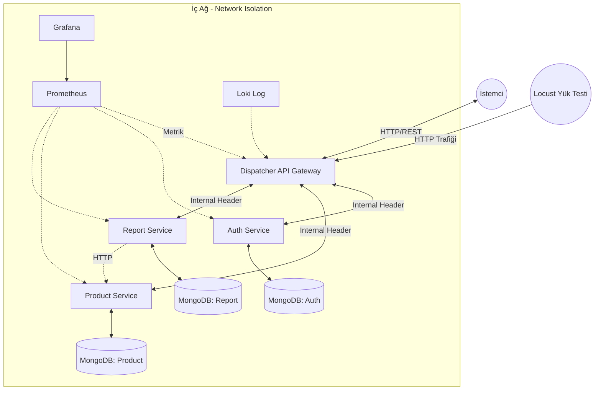

### b) Kullanıcı Login Olup Ürün Listesi Çekme (Sequence Diagram)
Kullanıcının sisteme girip, dönen JWT token ile ürünleri çekme adımları.

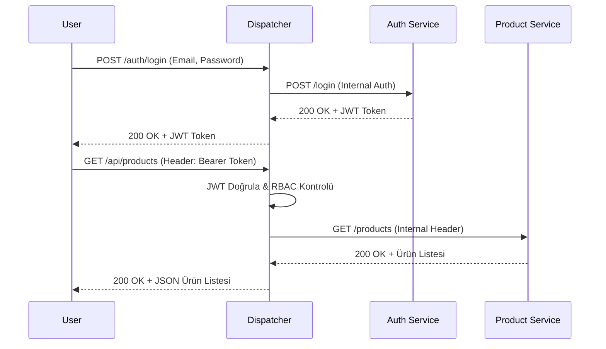

### c) Report Oluşturma (Sequence Diagram)
Report Service'in map-reduce formatında rapor üretmek için Product Service'den veri okuma akışı.

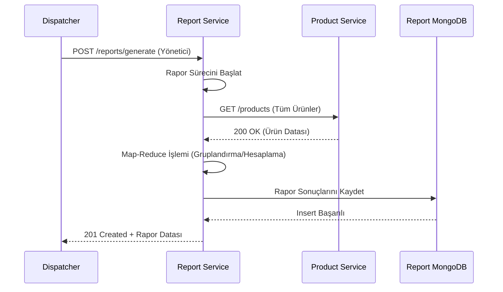

### d) Auth Service Sınıf Diyagramı (Class Diagram)
Auth Service'in Controller-Service-Repository katman yapısı.

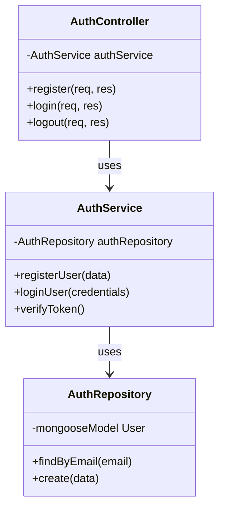

### e) Product Service Sınıf Diyagramı (Class Diagram)
Oluşturulan sınıf yapıları ve Abstract implementasyonu.

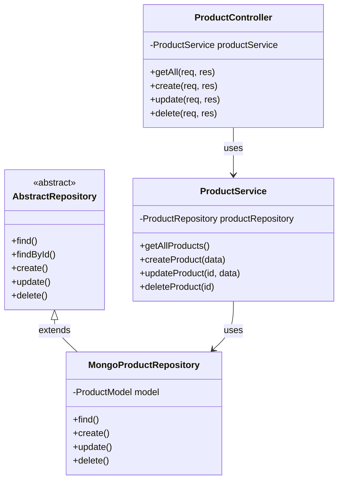

### f) TDD Red-Green-Refactor Akış Diyagramı

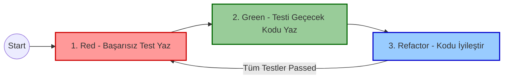

### g) Veritabanı Entity-Relationship (E-R) Diyagramı (NoSQL)
Koleksiyonların referanssal bağlantıları ve sakladıkları veriler aşağıda modellenmiştir. Veritabanı izolasyonu sayesinde her servis kendi verisine erişir.

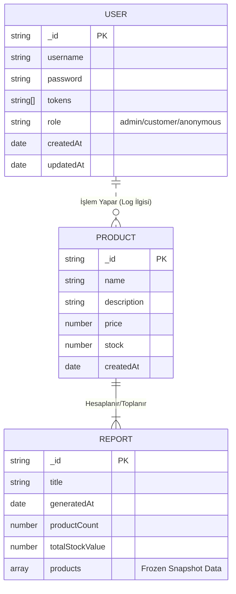

---

## 4. Ekran Görüntüleri 

> Not: Proje klasörü içerisinde bir `docs` klasörü oluşturularak uygulamanıza ait son ekran görüntüleri `docs/` klasörü altına aşağıda belirtilen isimlerle atılmalıdır.

- **Sistemlerin Docker-Compose ile Ayağa Kalkması ve Network İzolasyonu:**  
  *İç ağ izolasyonu (Network Isolation), `docker-compose.yml` yapılandırmasında mikroservislerin (Auth, Product vb.) portlarının dışarıya expose edilmeyip (`networks: private_net`) sadece `Dispatcher` uygulamasının (port 8080) dışarıya/host cihazına açılmasıyla sağlanmıştır. İstemciden gönderilen tüm istekler yalnızca Dispatcher'a düşmektedir.*  
  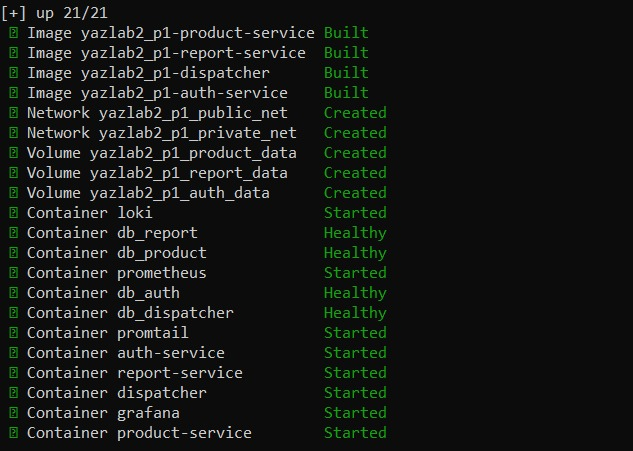
  
  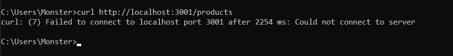

- **Terminal (cURL) Üzerinden Yapılan API İstekleri (Success ve Not Found Örnekleri) ve Flow:**  
  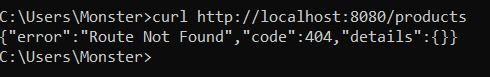
  
  

- **Locust ile Yapılan Yük Testi ve Performans İzleme Özeti:**  
  Yük testleri aşamalı olarak 50, 100 ve 200 kullanıcıyla gerçekleştirilmiştir:
  
  
  
  
  
  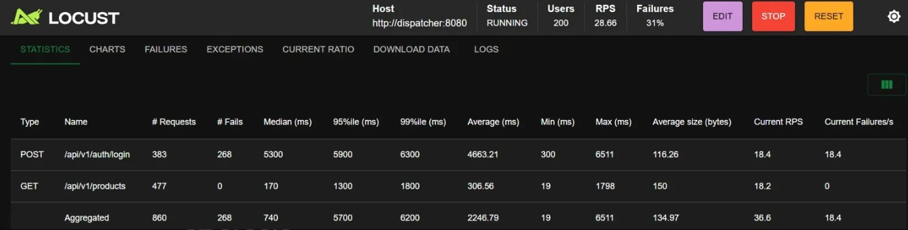
  
  
  
  **Yük Testi Performans Dağılım Tablosu (Sayısal Sonuçlar):**
  Locust veya JMeter ile oluşturulan eşzamanlı/paralel yüklenme anında elde edilen ortalama başarı ve yanıt süreleri:

  | Kullanıcı (Kapasite) | Ortalama Yanıt Süresi | Hata Oranı (%) |
  |----------------------|-----------------------|----------------|
  | 50                   | 233 ms                | %0             |
  | 100                  | 974 ms                | %1             |
  | 200                  | 2246 ms               | %31            |
  | 500                  | 5484 ms               | %100           |

- **Grafana Dashboard ve Metrik İzleme Bölümü:**  
  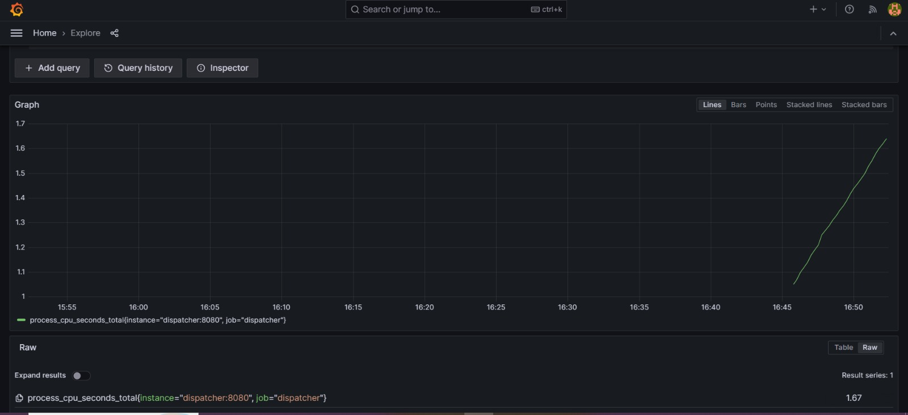

---

## 5. Sonuç ve Tartışma

**Başarılar:**
- Monolitik bir yapı yerine ayrık ve izole edilmiş mikroservis mimarisi başarılı bir şekilde inşa edildi.
- TDD pratikleri, Dispatcher gibi güvenlik ve yönlendirme açısından kritik bir yapıda hataları erken tespit etmeyi sağlayıp kaliteyi artırdı.
- OOP, Sınıf Katmanlama ve Repository Pattern ile sistem oldukça esnek, modüler ve değişikliklere dirençli bir hale (SOLID prensiplerine uygun) getirildi.
- Sistem monitoring araçları sayesinde (Prometheus, Grafana, Loki) ölçeklenme durumu tespit edilebilir bir seviyeye kavuştu.

**Sınırlılıklar:**
- Birden fazla izolasyonlu veritabanının (MongoDB) çalıştırılması projenin operasyonel karmaşıklığını ve bellek/işlemci tüketimini artırdı.
- İsteklerin HTTP protokolüne dayalı senkron süreçlere dönüştürülmesi nedeniyle yoğun trafiğe anlık cevap sürelerinde tolerans düşebilmektedir. Sistem özellikle **500 eşzamanlı kullanıcı yükünde tıkanarak %100 hata oranına ulaşmıştır**. Sistemin bu eşikte zorlanıp tepkisizleşmesi mevcut host kaynakları ve Node senkronizasyonu bağlamında tahmin edilen sınır noktasıdır (beklenen bir darboğazdır).

**Olası Geliştirmeler:**
- Report ile Product modülleri arasındaki haberleşmeyi asenkron bir mesaj kuyruğuna (Örn. RabbitMQ, Kafka) taşıyarak, bloklama olmadan daha etkili rapor üretim süreçleri oluşturulabilir.
- CI/CD metotları ve GitHub Actions entegrasyonu kullanılarak deployment ve test süreçleri otomasyon haline getirilebilir.
